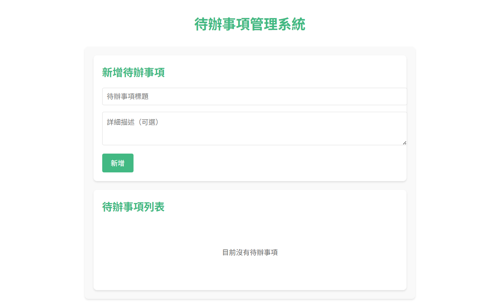
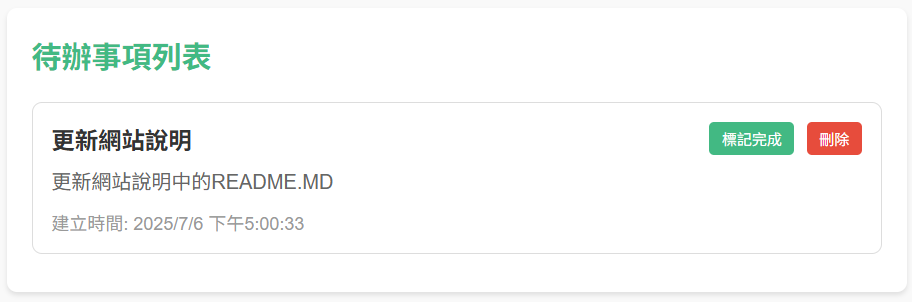
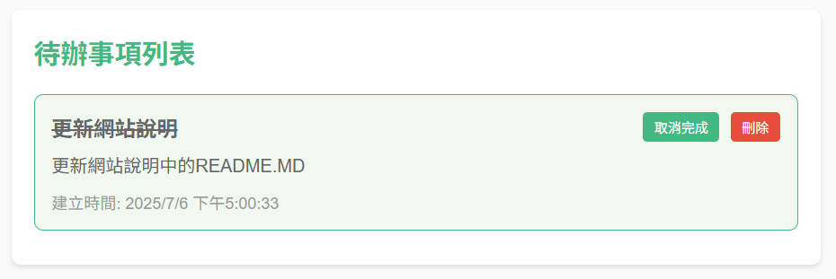

# 待辦事項管理系統 (Tasks Management Web)

一個使用 Vue.js 和 Flask 建立的現代化全端待辦事項管理系統，具有直觀的使用者介面和完整的 CRUD 功能。


## 📸 系統截圖

### 主介面


### 新增待辦事項


### 完成狀態


##  系統特色

-  **完整的 CRUD 操作** - 新增、查看、編輯、刪除待辦事項
-  **狀態管理** - 標記完成/未完成狀態
-  **響應式設計** - 採長條設計可以配合桌面和行動裝置的畫面
-  **RESTful API** - 標準化的 API 設計


##  使用技術

### 前端
| 技術 | 版本 | 用途 |
|------|------|------|
|  | 3.3.0 | 前端框架 |
|  | 4.4.0 | 構建工具 |
|  | 1.4.0 | HTTP 客戶端 |
|  | Latest | 樣式設計 |

### 後端
| 技術 | 版本 | 用途 |
|------|------|------|
|  | 2.2.5 | Web 框架 |
|  | 1.4.46 | ORM 工具 |
|  | 3 | 資料庫 |
|  | 3.9+ | 程式語言 |

## 📁 專案結構

```
TasksManageWeb/
├── 📁 backend/                 # 🐍 後端 Flask 應用
│   ├── 📄 app.py              # 🚀 主應用程式入口
│   ├── 📄 models.py           # 🗃️ 資料模型定義
│   ├── 📄 config.py           # ⚙️ 應用配置檔案
│   └── 📄 requirements.txt    # 📦 Python 依賴清單
├── 📁 frontend/               # 🎨 前端 Vue.js 應用
│   ├── 📁 public/            # 🌐 靜態資源
│   │   └── 📄 index.html     # 📄 HTML 模板
│   ├── 📁 src/               # 💻 原始碼
│   │   ├── 📁 components/    # 🧩 Vue 組件
│   │   │   ├── 📄 TodoList.vue
│   │   │   └── 📄 TodoItem.vue
│   │   ├── 📁 views/         # 📱 頁面視圖
│   │   │   └── 📄 Home.vue
│   │   ├── 📄 App.vue        # 🏠 根組件
│   │   └── 📄 main.js        # 🚪 應用入口
│   ├── 📄 package.json       # 📦 Node.js 依賴
│   └── 📄 vite.config.js     # ⚙️ Vite 配置
├── 📁 docs/                  # 📚 文檔和圖片
│   └── 📁 images/            # 🖼️ 專案截圖
├── 📄 .gitignore             # 🚫 Git 忽略檔案
└── 📄 README.md              # 📖 專案說明文檔

```

## 🚀 快速開始

### 📋 環境需求

-  **Python 3.9+**
-  **Node.js 18+**
-  **Git**

### 🐍 後端設置

1. **創建並啟動虛擬環境**
```bash
# 使用 Conda 如果未創建環境則可以使用下方的指令
# conda create -n vue-flask-env python=3.9
conda activate vue-flask-env
```

2. **安裝後端套件**
```bash
cd backend
pip install -r requirements.txt
python app.py
```

✅ 後端服務將在 `http://localhost:5000` 啟動

### 🎨 前端設置

#### 🟢 使用 Node.js
1. **創建並啟動虛擬環境**
```bash
# 使用 Conda 如果未創建環境則可以使用下方的指令
# conda create -n vue-flask-env python=3.9
conda activate vue-flask-env
```
2. **開啟前端服務**
```bash
cd frontend
npm install
npm run serve
```

## 📡 API 文檔

### 🔗 端點總覽

| HTTP 方法 | 端點 | 描述 | 狀態碼 |
|-----------|------|------|--------|
|  | `/api/todos` | 📋 獲取所有待辦事項 | 200 |
|  | `/api/todos` | ➕ 創建新的待辦事項 | 201 |
|  | `/api/todos/:id` | ✏️ 更新特定待辦事項 | 200 |
|  | `/api/todos/:id` | 🗑️ 刪除特定待辦事項 | 200 |

### 📝 請求/響應範例

#### ➕ 創建待辦事項

**請求**
```http
POST /api/todos
Content-Type: application/json

{
  "title": "完成專案文檔",
  "description": "撰寫完整的 API 文檔和使用說明"
}
```

**響應**
```json
{
  "id": 1,
  "title": "完成專案文檔",
  "description": "撰寫完整的 API 文檔和使用說明",
  "completed": false,
  "created_at": "2025-07-07T10:30:00.000Z",
  "updated_at": "2025-07-07T10:30:00.000Z"
}
```

#### 📋 獲取所有待辦事項

**請求**
```http
GET /api/todos
```

**響應**
```json
[
  {
    "id": 1,
    "title": "完成專案文檔",
    "description": "撰寫完整的 API 文檔和使用說明",
    "completed": false,
    "created_at": "2025-07-07T10:30:00.000Z",
    "updated_at": "2025-07-07T10:30:00.000Z"
  },
  {
    "id": 2,
    "title": "測試應用功能",
    "description": "進行全面的功能測試",
    "completed": true,
    "created_at": "2025-07-07T11:00:00.000Z",
    "updated_at": "2025-07-07T11:30:00.000Z"
  }
]
```

## 🎮 使用指南

### 1. 🏁 啟動應用
- 確保後端在 port 5000 運行
- 確保前端在 port 8080 運行
- 在瀏覽器中打開 `http://localhost:8080`

### 2. ➕ 新增待辦事項
- 在「新增待辦事項」區域輸入標題（必填）
- 可選擇性地添加描述
- 點擊「新增」按鈕

### 3. ✅ 管理待辦事項
- 點擊「標記完成」來切換完成狀態
- 點擊「刪除」來移除待辦事項
- 完成的項目會有不同的視覺效果

## 🔧 開發工具

### 💡 推薦的 VSCode 擴充套件

```json
{
  "recommendations": [
    "octref.vetur",           // Vue.js 支援
    "ms-python.python",       // Python 支援
    "esbenp.prettier-vscode", // 程式碼格式化
    "eamodio.gitlens",        // Git 增強
    "bradlc.vscode-tailwindcss", // Tailwind CSS 支援
    "ms-vscode.vscode-typescript-next" // TypeScript 支援
  ]
}
```

### 🐛 除錯技巧

1. **後端除錯**
   ```bash
   # 啟用 Flask 除錯模式
   export FLASK_DEBUG=1  # Linux/Mac
   set FLASK_DEBUG=1     # Windows
   python app.py
   ```

2. **前端除錯**
   - 使用瀏覽器開發者工具 (F12)
   - 檢查 Console 和 Network 標籤
   - 使用 Vue DevTools 擴充套件

## 🚀 部署指南

### 🌐 前端部署

#### Netlify 部署
```bash
# 建置專案
npm run build

# 上傳 dist/ 資料夾到 Netlify
```

#### Vercel 部署
```bash
# 安裝 Vercel CLI
npm i -g vercel

# 部署
vercel --prod
```

### 🐍 後端部署

#### Heroku 部署

1. 創建 `Procfile`
```
web: python app.py
```

2. 更新 `app.py`
```python
if __name__ == '__main__':
    port = int(os.environ.get('PORT', 5000))
    app.run(host='0.0.0.0', port=port)
```

3. 部署到 Heroku
```bash
heroku create your-app-name
git push heroku main
```

## 🤝 貢獻指南

我們歡迎任何形式的貢獻！請按照以下步驟：

1. 🍴 **Fork 此專案**
2. 🌿 **創建功能分支**
   ```bash
   git checkout -b feature/AmazingFeature
   ```
3. 💾 **提交您的變更**
   ```bash
   git commit -m 'Add some AmazingFeature'
   ```
4. 📤 **推送到分支**
   ```bash
   git push origin feature/AmazingFeature
   ```
5. 🔀 **開啟 Pull Request**

### 📝 提交規範

請使用 [Conventional Commits](https://www.conventionalcommits.org/) 格式：

```
feat: 新增功能
fix: 修復 bug
docs: 更新文檔
style: 程式碼格式調整
refactor: 重構程式碼
test: 增加測試
chore: 維護性工作
```

## 🐛 問題回報

如果您發現任何問題，請在 [Issues](https://github.com/wenjmis/TasksManageWeb/issues) 頁面回報，並包含：

- 🔍 問題的詳細描述
- 🔄 重現步驟
- 💻 您的環境資訊（OS、瀏覽器版本等）
- 📸 相關的截圖或錯誤訊息

## 📄 授權條款

此專案採用 MIT 授權條款 - 詳見 [LICENSE](LICENSE) 檔案


## 📈 更新日誌

### 🎉 v1.0.0 (2025-07-07)
- ✨ 初始版本發布
- ✨ 完整的 CRUD 功能實現
- ✨ Vue.js 3 + Flask 架構建立
- ✨ 響應式設計完成
- ✨ RESTful API 設計

---

<div align="center">

**⭐ 如果這個專案對您有幫助，請給我們一個星星！ ⭐**


Made with ❤️ by [劉文傑](https://github.com/wenjmis)

</div>